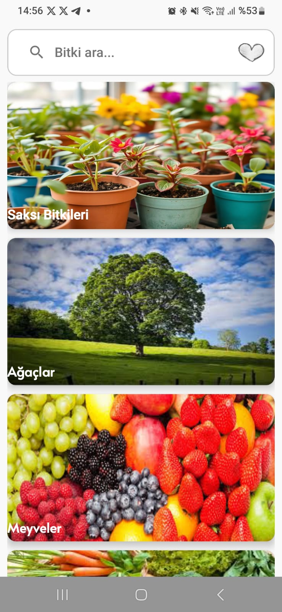
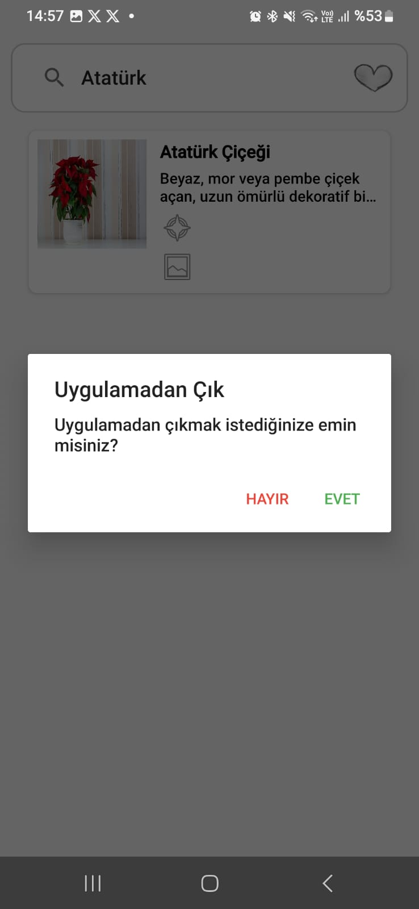
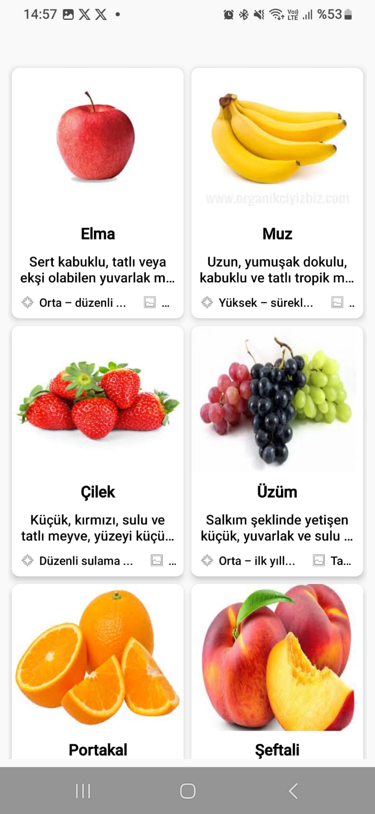
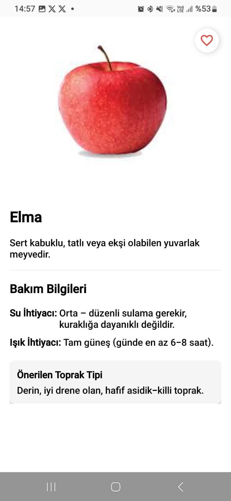
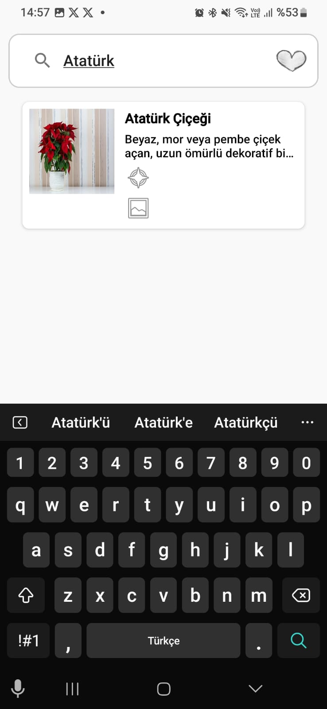
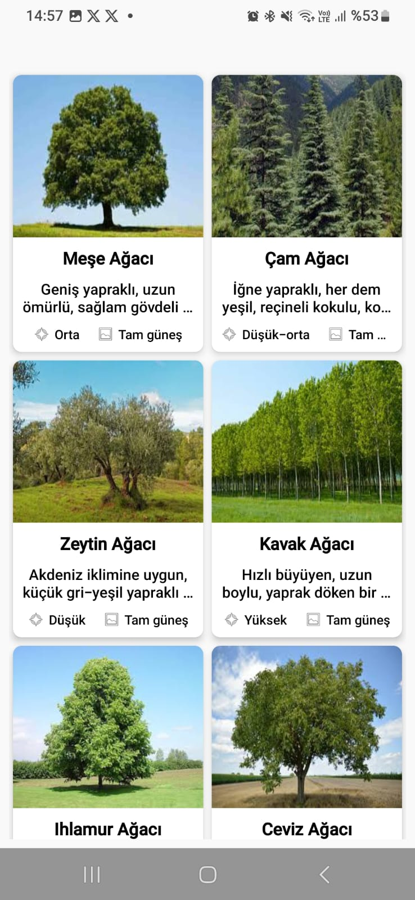

GrowEase
GrowEase, iç ve dış mekân bitkileri için temel bakım bilgilerini sunan bir Android uygulamasıdır. Kullanıcılar farklı bitki türleri hakkında detaylı bilgi alabilir, sulama ve ışık gereksinimlerini kolayca öğrenebilir.

Özellikler
🌱 Saksı bitkileri ve ağaç türleri hakkında bilgiler

💧 Sulama, ışık ve toprak gereksinimleri

🖼️ Bitkilerin görselleriyle birlikte detaylı tanıtımlar

📱 Basit ve kullanıcı dostu arayüz

Kullanılan Teknolojiler
Kotlin

Android Jetpack

RecyclerView

View Binding
 MVVM mimarisi

## Ekran Görüntüleri

Uygulamanın ana ekranında bitki kategorileri listelenmektedir: Saksı Bitkileri, Ağaçlar ve Meyveler.

🔚 Uygulamadan Çıkış
Kullanıcı deneyimini tamamlayan basit bir çıkış arayüzü sunulmuştur.
Geri bildirim süreciyle uyumlu ve sade bir kapanış ekranıdır.

🍎 Meyve Kartları Ekranı

Uygulamada kullanıcılar meyveler hakkında bilgi kartlarıyla görsel
ve metin destekli şekilde bilgilendirilir. 

📄 Meyve Detayları

Seçilen bir meyveye ait detay ekranında; toprak tipi, ışık gereksinimi ve sulama sıklığı gibi bilgiler yer alır.
Ayrıca kullanıcı dostu ikonlar ve düzenli görsel hiyerarşi ile bilgi hızlıca kavranabilir.

🔍 Arama Özelliği

Kullanıcılar uygulama içindeki bitkileri kolayca arayabilir. Örnekte "Atatürk" kelimesiyle yapılan arama sonucu "Atatürk Çiçeği" listelenmiştir.

🌳 Ağaç Kartları
Ağaç türlerini tanıtan bu ekran, her bir ağaç için ihtiyaç duyulan bakım bilgilerini kartlar üzerinde sunar.
Kartlar, kullanıcıların karşılaştırmalı değerlendirme yapabilmesini kolaylaştıracak şekilde optimize edilmiştir.

📌 Yol Haritası

Gelecek güncellemelerde uygulamaya eklenmesi planlanan bazı özellikler:

🔔 Bitki bakım hatırlatıcıları

📆 Takvim entegrasyonu ile sulama planlama

🧠 Yapay zekâ destekli bitki teşhisi (fotoğrafla bitki tanıma)

🌐 Çoklu dil desteği (İngilizce, Almanca vb.)

